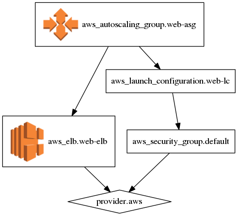
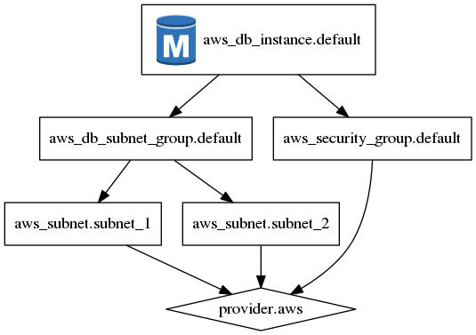

Terraform AWS Icons
===================

Combine `Terraform graph`_ and `AWS Icons`_.

.. _Terraform graph: https://www.terraform.io/docs/commands/graph.html
.. _AWS Icons: https://aws.amazon.com/architecture/icons/

Usage
-----

::

    pip install terraform-aws-icons
    terraform graph | terraform-iconify | dot -Tpng > graph.png

Examples
--------

Based on output from https://github.com/hashicorp/terraform/tree/master/examples:

``aws-asg.dot``:

``aws-rds.dot``:

License
-------

AWS icons are included with permission from Amazon Web Services.
